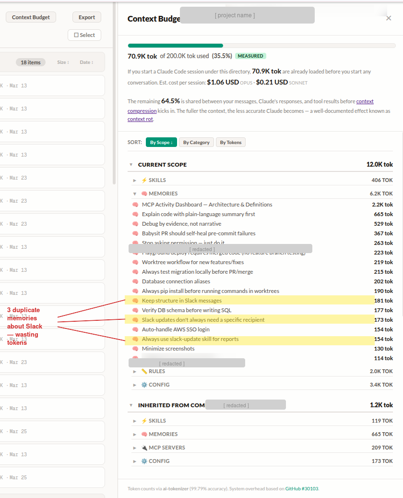

# Claude Code Organizer

[](https://www.npmjs.com/package/@mcpware/claude-code-organizer)
[](LICENSE)
[](https://nodejs.org)

[English](README.md) | [简体中文](README.zh-CN.md) | [繁體中文](README.zh-TW.md) | [廣東話](README.zh-HK.md) | [日本語](README.ja.md) | 한국어 | [Español](README.es.md) | [Bahasa Indonesia](README.id.md) | [Italiano](README.it.md) | [Português](README.pt-BR.md) | [Türkçe](README.tr.md) | [Tiếng Việt](README.vi.md) | [ไทย](README.th.md)

**Claude Code의 메모리, 스킬, MCP 서버, 훅을 한눈에 관리하는 대시보드. 스코프 계층으로 정리하고, 드래그 앤 드롭으로 스코프 간 이동.**


## 문제

Claude Code를 사용할 때마다 두 가지 일이 조용히 발생합니다 — 그리고 둘 다 여러분에게는 보이지 않습니다.

### 문제 1: context가 이미 얼마나 사용됐는지 모른다

2주간 사용한 실제 프로젝트 디렉토리입니다:



**이 디렉토리에서 Claude Code 세션을 시작하면, 대화를 시작하기도 전에 이미 70.9K tokens이 로드되어 있습니다.** 200K context window의 35.4%가 한 글자도 입력하기 전에 사라지는 셈입니다. 이 오버헤드만의 추정 비용: Opus에서 세션당 $1.06 USD, Sonnet에서 $0.21 USD.

나머지 64.5%는 여러분의 메시지, Claude의 응답, tool results가 공유하며, context compression이 시작될 때까지 사용됩니다. Context가 가득 찰수록 Claude는 덜 정확해집니다 — **context rot**이라고 알려진 현상입니다.

70.9K는 어디서 오는 걸까요? **오프라인으로 측정 가능한** 모든 것을 포함합니다 — CLAUDE.md, 메모리, 스킬, MCP server 정의, 설정, hooks, rules, commands, agents — 항목별 토큰화. 여기에 **추정 시스템 오버헤드**(~21K tokens) — Claude Code가 매번 API call에서 로드하는 불변 기반: system prompt, 23+ 개의 내장 tool 정의, MCP tool schemas.

그리고 이건 셀 수 있는 것들만입니다. **runtime injections** — Claude Code가 세션 중에 조용히 추가하는 tokens — 은 **포함되지 않습니다**:

- **Rule re-injection** — 모든 rule 파일이 매번 tool call 후에 context에 재주입됩니다. ~30번의 tool call 후, 이것만으로 context window의 ~46%를 소비할 수 있습니다
- **File change diffs** — 읽거나 쓴 파일이 외부에서 수정되면 (예: linter), 전체 diff가 숨겨진 system-reminder로 주입됩니다
- **System reminders** — 맬웨어 경고, token 알림, 기타 숨겨진 injections이 메시지에 추가됩니다
- **Conversation history** — 여러분의 메시지, Claude의 응답, 모든 tool results가 매번 API call에서 재전송됩니다

세션 중반의 실제 사용량은 70.9K보다 훨씬 높습니다. 단지 보이지 않을 뿐입니다.

### 문제 2: context가 오염되어 있다

Claude Code는 작업할 때마다 조용히 메모리, 스킬, MCP config, commands, agents, rules를 생성하고, 현재 디렉토리에 맞는 scope에 넣어버립니다. 모든 곳에서 적용되길 원하는 설정? 하나의 프로젝트에 갇힙니다. 하나의 레포만을 위한 배포 스킬? 글로벌에 새어 나와 모든 다른 프로젝트를 오염시킵니다.

글로벌에 있는 Python pipeline 스킬이 React frontend 세션에서도 로드됩니다. 중복된 MCP 항목이 같은 서버를 두 번 초기화합니다. 2주 전의 오래된 메모리가 현재 지시와 모순됩니다. scope가 잘못된 모든 항목은 token을 낭비하고 **게다가** 정확도도 떨어뜨립니다.

전체 그림을 볼 방법이 없습니다. 모든 scope, 모든 항목, 모든 상속을 한 번에 보여주는 명령어는 없습니다.

### 해결책: 비주얼 대시보드

```bash
npx @mcpware/claude-code-organizer
```

명령어 하나. Claude가 저장한 모든 것을 scope 계층별로 정리해서 봅니다. **시작하기 전에 token 예산을 확인합니다.** scope 간에 항목을 드래그합니다. 오래된 메모리를 삭제합니다. 중복을 찾습니다. Claude의 동작에 실제로 영향을 미치는 것을 제어합니다.

> **첫 실행 시 `/cco` skill이 자동 설치** — 이후 어떤 Claude Code 세션에서든 `/cco`를 입력하면 대시보드가 열립니다.

### 예시: token을 잡아먹는 것 찾기

대시보드를 열고, **Context Budget**을 클릭, **By Tokens**로 전환 — 가장 큰 소비자가 맨 위에 옵니다. 잊고 있던 2.4K token CLAUDE.md? 세 개의 scope에 중복된 스킬? 이제 보입니다. 정리하면 context window의 10-20%를 절약할 수 있습니다.

### 예시: scope 오염 수정

프로젝트 안에서 Claude에게 "TypeScript + ESM 선호"라고 했지만, 이 설정은 모든 곳에서 적용돼야 합니다. 그 메모리를 Project에서 Global로 드래그. **끝. 한 번 드래그.** 글로벌에 있는 배포 스킬이 실제로는 하나의 레포에서만 쓴다면? 해당 Project scope로 드래그 — 다른 프로젝트에서는 더 이상 보이지 않습니다.

### 예시: 오래된 메모리 삭제

Claude는 여러분이 대수롭지 않게 한 말이나, *기억해야 한다고 생각한* 것들로부터 자동으로 메모리를 만듭니다. 일주일 후에는 관련 없지만 여전히 매 세션마다 로드됩니다. 둘러보고, 읽고, 삭제. **Claude가 여러분에 대해 무엇을 알고 있다고 생각하는지, 여러분이 결정합니다.**

---

## 기능

- **스코프 계층 뷰** — Global > Workspace > Project로 정리, 상속 관계도 한눈에
- **드래그 앤 드롭** — 메모리, 스킬, MCP 서버를 스코프 간에 바로 이동
- **이동 전 확인** — 파일 건드리기 전에 반드시 확인 모달 표시
- **타입 안전성** — 메모리는 메모리 폴더로만, 스킬은 스킬 폴더로만 이동 가능
- **검색 & 필터** — 모든 항목 실시간 검색, 카테고리별 필터 (메모리, 스킬, MCP, 설정, 훅, 플러그인, 플랜)
- **Context Budget** — 아무것도 입력하기 전에 config가 얼마나 많은 tokens을 소비하는지 확인 — 항목별 분석, 상속된 scope 비용, 시스템 오버헤드 추정, 200K context 사용률
- **상세 패널** — 항목 클릭하면 메타데이터, 설명, 파일 경로 확인 + VS Code에서 바로 열기
- **의존성 제로** — 순수 Node.js 내장 모듈, SortableJS는 CDN으로
- **진짜 파일 이동** — `~/.claude/` 안의 파일을 실제로 옮깁니다. 보기만 하는 뷰어가 아닙니다
- **100+ E2E 테스트** — Playwright 테스트 스위트, filesystem 검증・보안(경로 순회, 잘못된 입력)・context budget・전체 11 카테고리 커버

## 빠른 시작

### 방법 1: npx (설치 불필요)

```bash
npx @mcpware/claude-code-organizer
```

### 방법 2: 글로벌 설치

```bash
npm install -g @mcpware/claude-code-organizer
claude-code-organizer
```

### 방법 3: Claude한테 부탁

Claude Code한테 이렇게 말하세요:

> `npx @mcpware/claude-code-organizer` 실행해줘. Claude Code 설정 관리하는 대시보드야. 준비되면 URL 알려줘.

`http://localhost:3847`에서 대시보드가 열립니다. 실제 `~/.claude/` 디렉토리를 직접 조작합니다.

## 관리 대상

| 타입 | 보기 | 스코프 간 이동 |
|------|:----:|:------------:|
| 메모리 (feedback, user, project, reference) | ✅ | ✅ |
| 스킬 | ✅ | ✅ |
| MCP 서버 | ✅ | ✅ |
| 설정 (CLAUDE.md, settings.json) | ✅ | 🔒 |
| 훅 | ✅ | 🔒 |
| 플러그인 | ✅ | 🔒 |
| 플랜 | ✅ | 🔒 |

## 스코프 계층

```
Global                       <- 모든 곳에 적용
  회사 (Workspace)            <- 하위 모든 프로젝트에 적용
    회사레포1                  <- 이 프로젝트 전용
    회사레포2                  <- 이 프로젝트 전용
  사이드프로젝트 (Project)      <- 독립 프로젝트
  문서 (Project)               <- 독립 프로젝트
```

하위 스코프는 상위 스코프의 메모리, 스킬, MCP 서버를 자동으로 상속합니다.

## 작동 방식

1. **스캔** `~/.claude/` — 모든 프로젝트, 메모리, 스킬, MCP 서버, 훅, 플러그인, 플랜 탐색
2. **계층 파악** — 파일 시스템 경로에서 부모-자식 관계 추론
3. **대시보드 렌더링** — 스코프 헤더 > 카테고리 바 > 항목 목록, 자동 들여쓰기
4. **이동 처리** — 드래그하거나 "이동…" 클릭하면 안전 검사 후 파일을 실제로 이동

## 플랫폼

| 플랫폼 | 상태 |
|--------|:----:|
| Ubuntu / Linux | ✅ 지원 |
| macOS | 아마 됩니다 (미테스트) |
| Windows | 미지원 |
| WSL | 아마 됩니다 (미테스트) |

## 라이선스

MIT

## 만든 사람

[ithiria894](https://github.com/ithiria894) — Claude Code 생태계를 위한 도구 제작.
